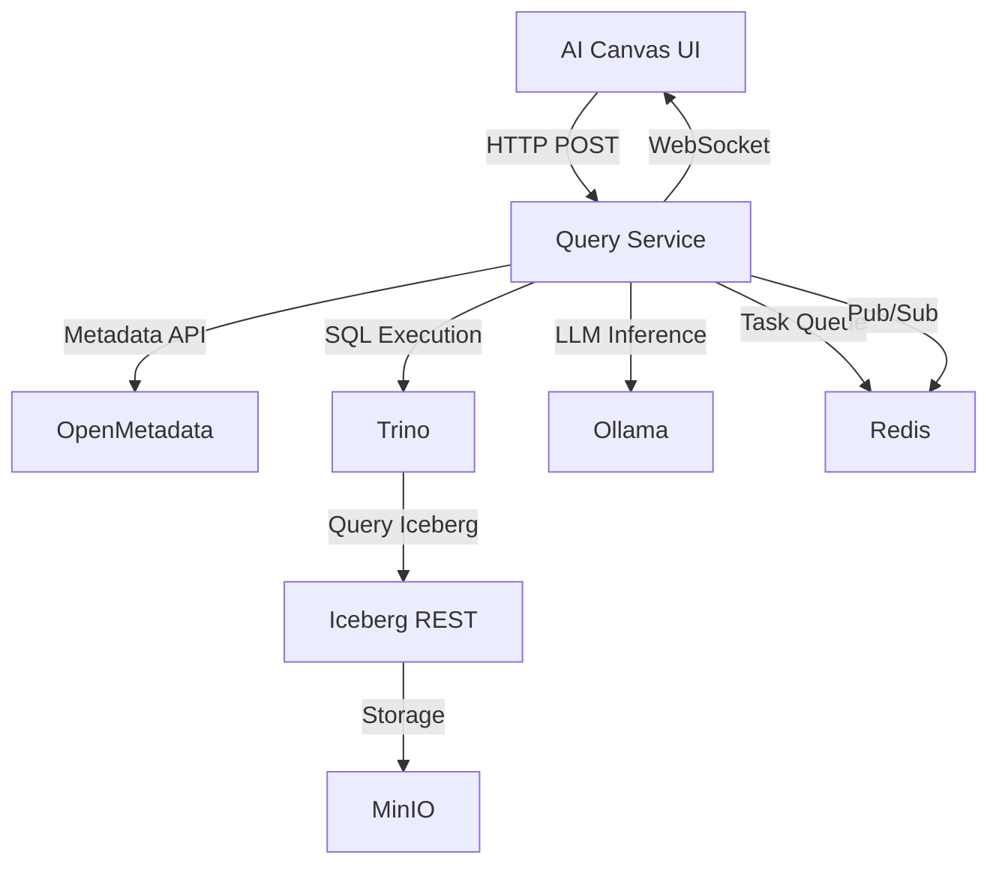

# Query Service Implementation Plan

## 📋 Executive Summary

This document provides a complete implementation plan for the **Query Service** - a Python backend that converts natural language queries into SQL, executes them against Apache Iceberg via Trino, and generates ECharts visualization configs. The service uses **LangGraph** for workflow orchestration and provides real-time progress updates via **WebSocket**.

---

## 🎯 Service Overview

### Core Capabilities
1. **Natural Language → SQL**: Parse NL queries using LLM
2. **Metadata Integration**: Fetch schema from OpenMetadata
3. **SQL Generation & Validation**: Generate and validate SQL with retry logic
4. **Query Execution**: Execute against Iceberg tables via Trino
5. **Chart Recommendation**: Suggest appropriate chart types
6. **ECharts Config Generation**: Create valid visualization configs
7. **Async Progress Updates**: Real-time status via WebSocket

### Architecture Pattern
- **Async Request-Response**: Immediate response with queryId + WebSocket URL
- **Progress Streaming**: WebSocket broadcasts workflow progress
- **Final Result**: Complete data + chart config sent via WebSocket

---

## 🏗️ Service Architecture

### Technology Stack

| Component | Technology | Version | Purpose |
|-----------|-----------|---------|---------|
| **API Framework** | FastAPI | 0.114.2 | REST API & WebSocket endpoints |
| **Workflow Engine** | LangGraph | 0.2.26 | Workflow orchestration with retry logic |
| **Task Queue** | Celery | 5.4.0 | Async task execution |
| **Message Broker** | Redis | 7 | Pub/Sub for WebSocket updates |
| **LLM Runtime** | Ollama | latest | Host Llama 3.1 models |
| **Query Engine** | Trino | 458 | Execute SQL on Iceberg |
| **Metadata Catalog** | OpenMetadata | 1.9.11 | Schema & table metadata |
| **Data Validation** | Pydantic | 2.9.2 | Schema validation |
| **LLM Framework** | LangChain | 0.2.16 | LLM interaction & prompting |

### Service Dependencies


---

## 🔄 Modified API Contract

### Changes to BACKEND-API-SPEC

#### Original Flow (Synchronous)
```
POST /api/v1/query-service/generate-chart
  ↓
[Wait 3-10 seconds]
  ↓
200 OK with full data + chart config
```

#### New Flow (Asynchronous)
```
POST /api/v1/query-service/generate-chart
  ↓ (Immediate response)
202 Accepted with queryId + WebSocket URL
  ↓
Client connects to WebSocket
  ↓
Stream progress updates:
  - "Parsing natural language query..."
  - "Fetching metadata from OpenMetadata..."
  - "Generating SQL query..."
  - "Validating SQL..."
  - "Executing query against Trino..."
  - "Generating chart configuration..."
  ↓
Final message: Complete result with data + chart config
```

### Updated API Specification

#### POST /api/v1/query-service/generate-chart

**Request Body** (Unchanged)
```typescript
interface ChartGenerationRequest {
  naturalLanguageQuery: string;
  constraints?: {
    chartType?: string;
    chartSize?: { cols: number; rows: number };
    position?: { x: number; y: number };
  };
  context?: {
    dashboardId?: string;
    existingCharts?: Array<{
      type: string;
      title: string;
      query: string;
    }>;
  };
}
```

**Response** (Modified - Immediate)
```typescript
interface ChartGenerationInitiated {
  queryId: string;              // UUID for tracking
  websocketUrl: string;         // WebSocket endpoint path
  status: "initiated";
}
```

**Example Response**
```json
{
  "queryId": "550e8400-e29b-41d4-a716-446655440000",
  "websocketUrl": "/ws/v1/query-service/status/550e8400-e29b-41d4-a716-446655440000",
  "status": "initiated"
}
```

#### WebSocket /ws/v1/query-service/status/{queryId}

**Message Types**

1. **Connection Confirmation**
```json
{
  "type": "CONNECTED",
  "queryId": "550e8400-...",
  "message": "Connected to query service",
  "timestamp": "2024-10-03T10:30:00Z"
}
```

2. **Progress Updates**
```json
{
  "type": "PROGRESS",
  "queryId": "550e8400-...",
  "stage": "parsing_query",
  "message": "Parsing natural language query...",
  "timestamp": "2024-10-03T10:30:01Z"
}
```

**Stages:**
- `parsing_query` - "Parsing natural language query..."
- `fetching_metadata` - "Fetching metadata from OpenMetadata..."
- `generating_sql` - "Generating SQL query..."
- `validating_sql` - "Validating SQL query..."
- `retrying_sql` - "SQL validation failed. Retrying with corrections..." (if retry needed)
- `executing_query` - "Executing query against data warehouse..."
- `recommending_chart` - "Analyzing data and recommending chart type..."
- `generating_chart_config` - "Generating ECharts configuration..."
- `completed` - "Query completed successfully"

3. **SQL Generation (Transparency)**
```json
{
  "type": "SQL_GENERATED",
  "queryId": "550e8400-...",
  "sqlQuery": "SELECT region, SUM(sales) as sales FROM...",
  "timestamp": "2024-10-03T10:30:03Z"
}
```

4. **Final Result**
```json
{
  "type": "COMPLETED",
  "queryId": "550e8400-...",
  "result": {
    "success": true,
    "data": [...],
    "chartConfig": {...},
    "metadata": {...},
    "naturalLanguageQuery": "..."
  },
  "timestamp": "2024-10-03T10:30:10Z"
}
```

5. **Error**
```json
{
  "type": "ERROR",
  "queryId": "550e8400-...",
  "error": {
    "success": false,
    "error": "Column 'region' not found in schema",
    "errorCode": "SQL_VALIDATION_ERROR",
    "details": {...}
  },
  "timestamp": "2024-10-03T10:30:05Z"
}
```

---

## 📁 Service Structure

### Directory Layout

```
services/query-service/
├── app/
│   ├── __init__.py
│   ├── main.py                      # FastAPI app & endpoints
│   ├── config.py                    # Configuration & env vars
│   ├── models.py                    # Pydantic models
│   │
│   ├── workflow/
│   │   ├── __init__.py
│   │   ├── query_workflow.py        # Main LangGraph workflow
│   │   ├── state.py                 # Workflow state definition
│   │   └── nodes/
│   │       ├── __init__.py
│   │       ├── nl_parser.py         # Node: Parse NL query
│   │       ├── metadata_fetcher.py  # Node: Fetch from OpenMetadata
│   │       ├── sql_generator.py     # Node: Generate SQL
│   │       ├── sql_validator.py     # Node: Validate SQL
│   │       ├── sql_executor.py      # Node: Execute via Trino
│   │       ├── chart_recommender.py # Node: Recommend chart type
│   │       └── echarts_generator.py # Node: Generate ECharts config
│   │
│   ├── services/
│   │   ├── __init__.py
│   │   ├── openmetadata_client.py   # OpenMetadata API client
│   │   ├── trino_client.py          # Trino query executor
│   │   ├── ollama_client.py         # Ollama LLM client
│   │   └── redis_publisher.py       # Redis pub/sub for WebSocket
│   │
│   ├── prompts/
│   │   ├── __init__.py
│   │   ├── nl_parser.py             # NL parsing prompts
│   │   ├── sql_generator.py         # SQL generation prompts
│   │   ├── chart_recommender.py     # Chart recommendation prompts
│   │   └── echarts_generator.py     # ECharts config prompts
│   │
│   ├── utils/
│   │   ├── __init__.py
│   │   ├── validators.py            # SQL & schema validation
│   │   ├── chart_rules.py           # Rule-based chart recommendations
│   │   └── helpers.py               # Utility functions
│   │
│   └── tasks.py                     # Celery tasks
│
├── tests/
│   ├── __init__.py
│   ├── test_workflow.py
│   ├── test_nodes.py
│   ├── test_services.py
│   └── test_api.py
│
├── Dockerfile
├── requirements.txt
└── README.md
```

---

## 🔌 LangGraph Workflow Implementation

### Workflow State Definition

```python
# app/workflow/state.py
from typing import TypedDict, Literal, Optional, List, Dict, Any
from pydantic import BaseModel

class QueryIntent(BaseModel):
    """Parsed intent from natural language"""
    metrics: List[str]          # e.g., ["sales", "revenue"]
    dimensions: List[str]       # e.g., ["region", "product"]
    filters: Dict[str, Any]     # e.g., {"quarter": "Q4", "year": 2024}
    aggregations: Dict[str, str] # e.g., {"sales": "SUM"}
    time_dimension: Optional[str] = None
    chart_hint: Optional[str] = None

class TableMetadata(BaseModel):
    """Schema metadata from OpenMetadata"""
    table_name: str
    schema_name: str
    columns: List[Dict[str, str]]
    relationships: List[Dict[str, Any]]

class SQLValidationResult(BaseModel):
    """SQL validation result"""
    is_valid: bool
    errors: List[str] = []
    warnings: List[str] = []
    suggestions: List[str] = []

class ChartRecommendation(BaseModel):
    """Chart type recommendation"""
    chart_type: str
    confidence: float
    reasoning: str
    size: Dict[str, int]

class WorkflowState(TypedDict):
    # Input
    query_id: str
    natural_language_query: str
    constraints: Optional[Dict[str, Any]]
    context: Optional[Dict[str, Any]]
    
    # Intermediate results
    parsed_intent: Optional[QueryIntent]
    metadata: Optional[List[TableMetadata]]
    generated_sql: Optional[str]
    validation_result: Optional[SQLValidationResult]
    query_results: Optional[List[Dict[str, Any]]]
    chart_recommendation: Optional[ChartRecommendation]
    echarts_config: Optional[Dict[str, Any]]
    
    # Control flow
    retry_count: int
    max_retries: int
    error: Optional[str]
    
    # Output
    final_result: Optional[Dict[str, Any]]
```

### Workflow Graph

```python
# app/workflow/query_workflow.py
from langgraph.graph import StateGraph, END
from langgraph.checkpoint.memory import MemorySaver
from .state import WorkflowState
from .nodes import (
    nl_parser,
    metadata_fetcher,
    sql_generator,
    sql_validator,
    sql_executor,
    chart_recommender,
    echarts_generator
)

def create_query_workflow():
    """Create and return the LangGraph workflow"""
    
    # Create graph
    workflow = StateGraph(WorkflowState)
    
    # Add nodes
    workflow.add_node("parse_nl", nl_parser.parse_natural_language)
    workflow.add_node("fetch_metadata", metadata_fetcher.fetch_metadata)
    workflow.add_node("generate_sql", sql_generator.generate_sql)
    workflow.add_node("validate_sql", sql_validator.validate_sql)
    workflow.add_node("execute_sql", sql_executor.execute_sql)
    workflow.add_node("recommend_chart", chart_recommender.recommend_chart)
    workflow.add_node("generate_echarts", echarts_generator.generate_echarts_config)
    
    # Define edges
    workflow.set_entry_point("parse_nl")
    
    workflow.add_edge("parse_nl", "fetch_metadata")
    workflow.add_edge("fetch_metadata", "generate_sql")
    workflow.add_edge("generate_sql", "validate_sql")
    
    # Conditional edge: validation success → execute, failure → retry or error
    workflow.add_conditional_edges(
        "validate_sql",
        route_after_validation,
        {
            "execute": "execute_sql",
            "retry_metadata": "fetch_metadata",  # Broaden search
            "retry_sql": "generate_sql",          # Regenerate with feedback
            "error": END                          # Max retries exceeded
        }
    )
    
    workflow.add_edge("execute_sql", "recommend_chart")
    workflow.add_edge("recommend_chart", "generate_echarts")
    workflow.add_edge("generate_echarts", END)
    
    # Compile with checkpointing for retry logic
    memory = MemorySaver()
    return workflow.compile(checkpointer=memory)


def route_after_validation(state: WorkflowState) -> str:
    """Routing logic after SQL validation"""
    validation = state["validation_result"]
    
    if validation.is_valid:
        return "execute"
    
    retry_count = state["retry_count"]
    max_retries = state.get("max_retries", 2)
    
    if retry_count >= max_retries:
        state["error"] = f"SQL validation failed after {max_retries} retries"
        return "error"
    
    # Increment retry counter
    state["retry_count"] = retry_count + 1
    
    # Decide retry strategy based on error type
    errors = validation.errors
    if any("table" in err.lower() or "column" in err.lower() for err in errors):
        # Missing entities → broaden metadata search
        return "retry_metadata"
    else:
        # Syntax/logic error → regenerate SQL with feedback
        return "retry_sql"
```

### Node Implementations (Examples)

#### NL Parser Node
```python
# app/workflow/nodes/nl_parser.py
from langchain_community.chat_models import ChatOllama
from langchain.prompts import ChatPromptTemplate
from ...services.redis_publisher import publish_progress
from ...services.ollama_client import get_llm
from ...prompts.nl_parser import NL_PARSER_PROMPT
from ..state import WorkflowState, QueryIntent

async def parse_natural_language(state: WorkflowState) -> WorkflowState:
    """Parse natural language query into structured intent"""
    
    # Publish progress
    await publish_progress(
        state["query_id"],
        "parsing_query",
        "Parsing natural language query..."
    )
    
    # Get LLM
    llm = get_llm(model="llama3.1:70b", temperature=0.1)
    
    # Create prompt
    prompt = ChatPromptTemplate.from_template(NL_PARSER_PROMPT)
    chain = prompt | llm
    
    # Parse query
    nl_query = state["natural_language_query"]
    context = state.get("context", {})
    
    result = await chain.ainvoke({
        "query": nl_query,
        "context": context,
        "existing_charts": context.get("existingCharts", [])
    })
    
    # Parse LLM output into QueryIntent
    intent = QueryIntent.parse_raw(result.content)
    
    state["parsed_intent"] = intent
    return state
```

#### SQL Validator Node
```python
# app/workflow/nodes/sql_validator.py
from ...services.openmetadata_client import OpenMetadataClient
from ...services.redis_publisher import publish_progress
from ...utils.validators import validate_sql_syntax, validate_sql_against_schema
from ..state import WorkflowState, SQLValidationResult

async def validate_sql(state: WorkflowState) -> WorkflowState:
    """Validate generated SQL against schema"""
    
    await publish_progress(
        state["query_id"],
        "validating_sql",
        "Validating SQL query..."
    )
    
    sql = state["generated_sql"]
    metadata = state["metadata"]
    
    # Step 1: Syntax validation
    syntax_result = validate_sql_syntax(sql)
    if not syntax_result.is_valid:
        state["validation_result"] = syntax_result
        return state
    
    # Step 2: Schema validation
    schema_result = validate_sql_against_schema(sql, metadata)
    state["validation_result"] = schema_result
    
    # Publish SQL if valid
    if schema_result.is_valid:
        await publish_progress(
            state["query_id"],
            "sql_generated",
            sql,
            message_type="SQL_GENERATED"
        )
    
    return state
```

---

## 🐳 Docker Compose Configuration

### New Services to Add

```yaml
# Add to docker-compose.yml

services:
  # ... existing services ...

  # Query Service (New)
  query-service:
    build:
      context: ./services/query-service
      dockerfile: Dockerfile
    environment:
      - REDIS_URL=redis://redis:6379/1  # Use DB 1 to separate from agent-workflow
      - OPENMETADATA_API_ENDPOINT=http://openmetadata-server:8585/api
      - OPENMETADATA_JWT_TOKEN=${OPENMETADATA_JWT_TOKEN}
      - TRINO_HOST=trino
      - TRINO_PORT=8080
      - TRINO_CATALOG=iceberg
      - TRINO_SCHEMA=default
      - OLLAMA_HOST=http://ollama:11434
      - OLLAMA_NL_MODEL=llama3.1:70b       # For NL parsing & SQL generation
      - OLLAMA_CHART_MODEL=llama3.1:8b     # For chart recommendations (fallback)
      - SERVICE_HOST=query-service
      - SERVICE_PORT=8000
      # LangSmith observability
      - LANGCHAIN_TRACING_V2=true
      - LANGCHAIN_PROJECT=democritus-query-service
      - LANGCHAIN_ENDPOINT=https://api.smith.langchain.com
      - LANGCHAIN_API_KEY=${LANGCHAIN_API_KEY:-}
    depends_on:
      - redis
      - ollama
      - trino
      - openmetadata-server
    restart: unless-stopped
    healthcheck:
      test: ["CMD", "curl", "-f", "http://localhost:8000/health"]
      interval: 30s
      timeout: 10s
      retries: 3

  # Query Service Worker (Celery)
  query-service-worker:
    build:
      context: ./services/query-service
      dockerfile: Dockerfile
    command: ["celery", "-A", "app.tasks:celery_app", "worker", "-l", "info", "-Q", "query-service"]
    environment:
      - REDIS_URL=redis://redis:6379/1
      - OPENMETADATA_API_ENDPOINT=http://openmetadata-server:8585/api
      - OPENMETADATA_JWT_TOKEN=${OPENMETADATA_JWT_TOKEN}
      - TRINO_HOST=trino
      - TRINO_PORT=8080
      - TRINO_CATALOG=iceberg
      - TRINO_SCHEMA=default
      - OLLAMA_HOST=http://ollama:11434
      - OLLAMA_NL_MODEL=llama3.1:70b
      - OLLAMA_CHART_MODEL=llama3.1:8b
      - LANGCHAIN_TRACING_V2=true
      - LANGCHAIN_PROJECT=democritus-query-service
      - LANGCHAIN_ENDPOINT=https://api.smith.langchain.com
      - LANGCHAIN_API_KEY=${LANGCHAIN_API_KEY:-}
    depends_on:
      - redis
      - ollama
      - trino
      - openmetadata-server
    restart: unless-stopped

  # Trino Query Engine (New)
  trino:
    image: trinodb/trino:458
    ports:
      - "8080:8080"
    volumes:
      - ./infra/trino/catalog/iceberg.properties:/etc/trino/catalog/iceberg.properties:ro
      - ./infra/trino/config.properties:/etc/trino/config.properties:ro
    environment:
      - ICEBERG_REST_URI=http://iceberg-rest:8181
      - AWS_REGION=us-east-1
      - AWS_ACCESS_KEY_ID=minioadmin
      - AWS_SECRET_ACCESS_KEY=minioadmin
      - S3_ENDPOINT=http://minio:9000
      - S3_PATH_STYLE_ACCESS=true
    depends_on:
      - iceberg-rest
      - minio
    restart: unless-stopped
    healthcheck:
      test: ["CMD", "curl", "-f", "http://localhost:8080/v1/info"]
      interval: 30s
      timeout: 10s
      retries: 5

  # Ollama Model Loader (Init Container)
  ollama-init:
    image: ollama/ollama:latest
    depends_on:
      - ollama
    entrypoint: /bin/sh -c
    command: >
      "sleep 10 &&
       ollama pull llama3.1:70b &&
       ollama pull llama3.1:8b"
    volumes:
      - ollama:/root/.ollama
    restart: "no"
```

### Trino Configuration Files

Create `infra/trino/` directory with configuration:

**infra/trino/config.properties**
```properties
coordinator=true
node-scheduler.include-coordinator=true
http-server.http.port=8080
discovery.uri=http://localhost:8080
query.max-memory=2GB
query.max-memory-per-node=1GB
```

**infra/trino/catalog/iceberg.properties**
```properties
connector.name=iceberg
iceberg.catalog.type=rest
iceberg.rest-catalog.uri=http://iceberg-rest:8181
iceberg.file-format=PARQUET
hive.s3.endpoint=http://minio:9000
hive.s3.path-style-access=true
hive.s3.aws-access-key=minioadmin
hive.s3.aws-secret-key=minioadmin
```

### Update Nginx Configuration

```nginx
# Add to infra/nginx/nginx.conf

http {
    # ... existing config ...
    
    upstream query_service {
        server query-service:8000;
    }
    
    server {
        listen 80;
        
        # ... existing locations ...
        
        # Query Service REST API
        location /api/v1/query-service/ {
            proxy_pass http://query_service;
            proxy_set_header Host $host;
            proxy_set_header X-Real-IP $remote_addr;
            proxy_set_header X-Forwarded-For $proxy_add_x_forwarded_for;
            proxy_set_header X-Forwarded-Proto $scheme;
        }
        
        # Query Service WebSocket
        location /ws/v1/query-service/ {
            proxy_pass http://query_service;
            proxy_http_version 1.1;
            proxy_set_header Upgrade $http_upgrade;
            proxy_set_header Connection "upgrade";
            proxy_set_header Host $host;
            proxy_set_header X-Real-IP $remote_addr;
            proxy_read_timeout 3600s;
            proxy_send_timeout 3600s;
        }
    }
}
```

---

## 📦 Dependencies

### requirements.txt

```txt
# Web Framework
fastapi==0.114.2
uvicorn[standard]==0.30.6

# Async Task Processing
celery==5.4.0
redis==5.0.7
redis[hiredis]==5.0.7

# WebSocket
websockets==12.0

# Data Validation
pydantic==2.9.2
pydantic-settings==2.5.2

# LLM & Workflow
langchain==0.2.16
langchain-community==0.2.16
langgraph==0.2.26
langsmith==0.1.121

# Database Clients
trino==0.329.0                  # Trino Python client
pyiceberg==0.7.1                # Iceberg Python SDK

# Metadata Client
openmetadata-ingestion==1.9.11

# Data Processing
pandas==2.1.4
pyarrow==18.1.0

# HTTP Clients
httpx==0.27.2
aiohttp==3.10.10

# Utilities
python-dateutil==2.9.0
python-json-logger==2.0.7

# Testing
pytest==8.3.3
pytest-asyncio==0.24.0
pytest-mock==3.14.0
httpx-sse==0.4.0
```

---

## 🔐 Environment Variables

### Query Service Environment Variables

```bash
# Redis
REDIS_URL=redis://redis:6379/1

# OpenMetadata
OPENMETADATA_API_ENDPOINT=http://openmetadata-server:8585/api
OPENMETADATA_JWT_TOKEN=<ingestion-bot-token>

# Trino
TRINO_HOST=trino
TRINO_PORT=8080
TRINO_CATALOG=iceberg
TRINO_SCHEMA=default
TRINO_USER=trino
TRINO_AUTH_TYPE=none  # or "basic" for production

# Ollama
OLLAMA_HOST=http://ollama:11434
OLLAMA_NL_MODEL=llama3.1:70b
OLLAMA_CHART_MODEL=llama3.1:8b
OLLAMA_TIMEOUT=120

# Service Config
SERVICE_HOST=query-service
SERVICE_PORT=8000
MAX_RETRIES=2
QUERY_TIMEOUT=300  # 5 minutes
MAX_RESULT_ROWS=10000

# LangSmith (Optional - for debugging)
LANGCHAIN_TRACING_V2=true
LANGCHAIN_PROJECT=democritus-query-service
LANGCHAIN_ENDPOINT=https://api.smith.langchain.com
LANGCHAIN_API_KEY=<your-langsmith-key>

# Logging
LOG_LEVEL=INFO
LOG_FORMAT=json
```

---

## 🧪 Testing Strategy

### Test Categories

#### 1. Unit Tests

**test_nl_parser.py**
- Parse simple queries ("sales by region")
- Parse time-series queries ("revenue over last 12 months")
- Parse filtered queries ("top 10 products by revenue")
- Handle ambiguous queries
- Parse with dashboard context

**test_sql_generator.py**
- Generate SELECT with aggregation
- Generate GROUP BY clauses
- Generate WHERE filters
- Generate ORDER BY + LIMIT
- Handle joins (multi-table)

**test_sql_validator.py**
- Validate correct SQL
- Detect missing tables
- Detect missing columns
- Detect invalid joins
- Detect unsupported functions

**test_chart_recommender.py**
- Categorical + numeric → bar chart
- Time series → line chart
- Multiple metrics → multi-line
- Parts of whole → pie chart
- Single value → KPI card

#### 2. Integration Tests

**test_workflow_integration.py**
- End-to-end workflow execution
- Retry logic on validation failure
- Metadata fetch → SQL gen → validation → execution
- Error handling and propagation

**test_trino_integration.py**
- Connect to Trino
- Execute simple query
- Handle query errors
- Result parsing and transformation

**test_openmetadata_integration.py**
- Fetch table metadata
- Fetch column schemas
- Handle missing tables
- Authentication

#### 3. E2E Tests

**test_api_e2e.py**
- POST request → receive queryId
- WebSocket connection
- Receive progress updates
- Receive final result
- Error scenarios

### Test Data Setup

Create test tables in Iceberg:
```sql
-- Test table: sales_data
CREATE TABLE iceberg.default.sales_data (
    id BIGINT,
    region VARCHAR,
    product VARCHAR,
    sales DECIMAL(10,2),
    quantity INT,
    sale_date DATE
);

-- Insert test data
INSERT INTO iceberg.default.sales_data VALUES
    (1, 'North', 'Widget', 45000, 150, DATE '2024-10-01'),
    (2, 'South', 'Gadget', 38000, 120, DATE '2024-10-01'),
    (3, 'East', 'Widget', 52000, 180, DATE '2024-10-01'),
    (4, 'West', 'Gadget', 41000, 140, DATE '2024-10-01');
```

---

## 🚀 Implementation Phases

### Phase 1: Foundation (Week 1)
- [ ] Set up service directory structure
- [ ] Create Docker configuration (Trino, updated compose)
- [ ] Implement basic FastAPI app with health check
- [ ] Set up Celery task queue
- [ ] Implement Redis pub/sub for WebSocket
- [ ] Create Pydantic models and workflow state
- [ ] Test Trino connection and basic query execution

### Phase 2: Core Workflow (Week 2)
- [ ] Implement LangGraph workflow skeleton
- [ ] Implement NL Parser node (with Ollama)
- [ ] Implement Metadata Fetcher node (OpenMetadata client)
- [ ] Implement SQL Generator node
- [ ] Implement SQL Validator node
- [ ] Test workflow up to SQL validation (without execution)

### Phase 3: Execution & Charting (Week 3)
- [ ] Implement SQL Executor node (Trino integration)
- [ ] Implement Chart Recommender node (rule-based + LLM)
- [ ] Implement ECharts Generator node
- [ ] Implement retry logic and conditional routing
- [ ] End-to-end workflow testing

### Phase 4: API & WebSocket (Week 4)
- [ ] Implement POST /generate-chart endpoint
- [ ] Implement WebSocket status endpoint
- [ ] Integrate workflow with Celery tasks
- [ ] Progress updates via Redis pub/sub
- [ ] Error handling and edge cases

### Phase 5: Integration & Testing (Week 5)
- [ ] Update Nginx configuration
- [ ] Integration testing with AI Canvas UI
- [ ] Performance optimization
- [ ] Load testing (concurrent queries)
- [ ] Documentation and examples

---

## 📊 Performance Considerations

### Expected Response Times

| Stage | Duration | Notes |
|-------|----------|-------|
| NL Parsing | 2-4s | Llama 3.1 70B inference |
| Metadata Fetch | 0.5-1s | OpenMetadata API call |
| SQL Generation | 3-5s | Llama 3.1 70B inference |
| SQL Validation | 0.2-0.5s | Local validation |
| Query Execution | 1-10s | Depends on query complexity |
| Chart Recommendation | 0.5-2s | Rule-based (fast) or LLM (slower) |
| ECharts Config Gen | 2-4s | Llama 3.1 inference |
| **Total** | **9-27s** | Typical: 12-15s |

### Optimization Strategies

1. **LLM Caching**: Cache identical queries for 5 minutes
2. **Metadata Caching**: Cache table schemas for 10 minutes
3. **Parallel Execution**: Run independent LLM calls in parallel
4. **Model Selection**: Use smaller models where accuracy allows
5. **Query Result Limits**: Cap at 10,000 rows, suggest filtering
6. **Trino Query Timeout**: 5-minute max execution time

### Scalability

- **Horizontal Scaling**: Run multiple query-service-worker containers
- **Celery Queue**: Use separate Redis DB or Redis Cluster
- **Ollama Scaling**: Deploy multiple Ollama instances with load balancer
- **Trino Workers**: Add Trino worker nodes for query parallelism

---

## 🔒 Security Considerations

### Authentication & Authorization
- Validate JWT token on all API requests
- Use OpenMetadata user permissions for data access
- Implement row-level security via Trino policies

### SQL Injection Prevention
- Use parameterized queries in Trino client
- Validate generated SQL before execution
- Sanitize all user inputs

### Rate Limiting
- 60 requests per minute per user (query initiation)
- 10 concurrent WebSocket connections per user
- Query execution timeout: 5 minutes

### Data Privacy
- Do not log sensitive data (PII) in query results
- Mask sensitive columns in metadata responses
- Encrypt WebSocket connections (WSS) in production

---

## 📝 Documentation Requirements

### API Documentation
- OpenAPI/Swagger spec for REST endpoints
- WebSocket message schema documentation
- Example requests and responses

### Workflow Documentation
- LangGraph workflow diagram
- Node descriptions and responsibilities
- Retry logic and error handling flows

### Deployment Guide
- Docker Compose setup instructions
- Environment variable reference
- Trino configuration guide
- Ollama model download and setup

### Developer Guide
- Service architecture overview
- Adding new chart types
- Customizing prompts
- Testing guide

---

## 🐛 Monitoring & Debugging

### Metrics to Track
- Query initiation rate (queries/min)
- Average query completion time
- Success rate vs. error rate
- Retry frequency
- LLM token usage
- Trino query performance

### Logging
- Structured JSON logging
- Log levels: DEBUG, INFO, WARNING, ERROR
- Key events:
  - Query initiated
  - Each workflow stage started/completed
  - SQL generated
  - Validation failures
  - Query execution errors
  - Final result sent

### Observability
- **LangSmith**: Trace LLM calls and workflow execution
- **Celery Flower**: Monitor task queue and worker status
- **Trino UI**: Monitor query execution (http://localhost:8080)
- **Redis Insight**: Monitor pub/sub channels

---

## 🚧 Known Limitations & Future Enhancements

### Phase 1 Limitations
- Single catalog support (Iceberg only)
- English language only
- Maximum 10,000 result rows
- No query result caching across users
- Basic chart types only (no combo charts)

### Future Enhancements (Phase 2+)

#### Multi-Step Conversations
- Maintain conversation context
- Support follow-up queries ("now break down by category")
- Reference previous charts in dashboard

#### Advanced Visualizations
- Combo charts (bar + line)
- Stacked/grouped charts
- Dual-axis charts
- Geographic maps
- Gantt charts

#### Data Source Expansion
- Support multiple catalogs (Hive, Delta Lake)
- Cross-catalog joins
- Real-time streaming data sources

#### Performance Optimization
- Query result caching with Redis
- Incremental query results (pagination)
- Pre-computed aggregations (OLAP cubes)

#### Enterprise Features
- Dashboard templates
- Scheduled query refresh
- Metric alerts and thresholds
- Export to PDF/Excel
- Collaboration (shared dashboards)

---

## 📋 Acceptance Criteria

### Functional Requirements
- ✅ Accept natural language queries via REST API
- ✅ Return queryId and WebSocket URL immediately (< 100ms)
- ✅ Stream progress updates via WebSocket
- ✅ Generate valid SQL from natural language
- ✅ Validate SQL against OpenMetadata schema
- ✅ Execute SQL via Trino against Iceberg tables
- ✅ Recommend appropriate chart type
- ✅ Generate valid ECharts configuration
- ✅ Support chart constraints from UI (type, size)
- ✅ Handle errors gracefully with helpful messages
- ✅ Retry SQL generation on validation failure (max 2 retries)

### Non-Functional Requirements
- ✅ Average query completion time < 15 seconds
- ✅ Support 10+ concurrent users
- ✅ Handle up to 10,000 data points efficiently
- ✅ 99% uptime (excluding Ollama model loading)
- ✅ Secure API (JWT authentication)
- ✅ Comprehensive logging and observability

### Integration Requirements
- ✅ Integrate with AI Canvas UI (WebSocket client)
- ✅ Integrate with OpenMetadata (metadata fetch)
- ✅ Integrate with Trino (query execution)
- ✅ Integrate with Ollama (LLM inference)
- ✅ Route via Nginx proxy
- ✅ Deploy via Docker Compose

---

## 🎯 Success Metrics

### Developer Experience
- Time to add new chart type: < 2 hours
- Time to add new prompt: < 1 hour
- Time to debug failed query: < 15 minutes

### User Experience
- Query success rate: > 85%
- Average query time: < 15 seconds
- User satisfaction with chart recommendations: > 80%

### System Performance
- Throughput: 100 queries/hour per worker
- Error rate: < 15%
- Retry rate: < 30%

---

## 📚 References

### Documentation Links
- [LangGraph Documentation](https://langchain-ai.github.io/langgraph/)
- [Trino Documentation](https://trino.io/docs/current/)
- [Apache Iceberg](https://iceberg.apache.org/)
- [OpenMetadata API](https://docs.open-metadata.org/developers/apis)
- [Ollama Documentation](https://github.com/ollama/ollama)
- [ECharts Documentation](https://echarts.apache.org/en/option.html)

### Similar Projects
- [Text-to-SQL with LangChain](https://python.langchain.com/docs/use_cases/sql/)
- [DataChat](https://datachat.ai/) - Commercial NL-to-SQL platform
- [Thoughtspot](https://www.thoughtspot.com/) - AI-powered analytics

---

## 🤝 Team & Responsibilities

### Backend Team
- Implement Query Service core logic
- Develop LangGraph workflow
- Integrate with Trino and OpenMetadata
- Write unit and integration tests

### DevOps Team
- Set up Trino in Docker Compose
- Configure Ollama with required models
- Update Nginx configuration
- Set up monitoring and logging

### Frontend Team (AI Canvas)
- Implement WebSocket client
- Display progress updates in chat UI
- Render ECharts from generated config
- Handle errors and retry logic

---

## ✅ Checklist for Go-Live

### Infrastructure
- [ ] Trino running and connected to Iceberg
- [ ] Ollama with Llama 3.1 models loaded (70B, 8B)
- [ ] Redis running on separate DB (db=1)
- [ ] OpenMetadata accessible with valid JWT token
- [ ] Nginx configured with query-service routes

### Service Deployment
- [ ] query-service container running
- [ ] query-service-worker container running
- [ ] Health checks passing
- [ ] Environment variables configured
- [ ] Logs streaming to console

### Testing
- [ ] Unit tests passing (> 80% coverage)
- [ ] Integration tests passing
- [ ] E2E test with AI Canvas UI successful
- [ ] Load test with 10 concurrent queries successful
- [ ] Error scenarios handled gracefully

### Documentation
- [ ] API documentation published
- [ ] Deployment guide written
- [ ] Developer guide written
- [ ] Runbook for common issues created

### Monitoring
- [ ] LangSmith tracing enabled
- [ ] Celery Flower accessible
- [ ] Logs searchable and structured
- [ ] Alerts configured for errors

---

## 🎉 Conclusion

This implementation plan provides a comprehensive roadmap for building the Query Service. The service leverages OSS technologies (LangGraph, Ollama, Trino, OpenMetadata) to deliver an AI-powered natural language query interface with real-time progress updates via WebSocket.

**Key Highlights:**
- ✅ **Async Architecture**: Non-blocking query processing with progress streaming
- ✅ **Robust Workflow**: LangGraph with retry logic and validation
- ✅ **OSS-First**: No proprietary dependencies
- ✅ **Production-Ready**: Comprehensive testing, monitoring, and security

**Next Steps:**
1. Review and approve this plan
2. Set up development environment
3. Begin Phase 1 implementation
4. Schedule weekly sync meetings for progress updates

---

**Document Version:** 1.0  
**Last Updated:** October 3, 2025  
**Status:** Ready for Review

